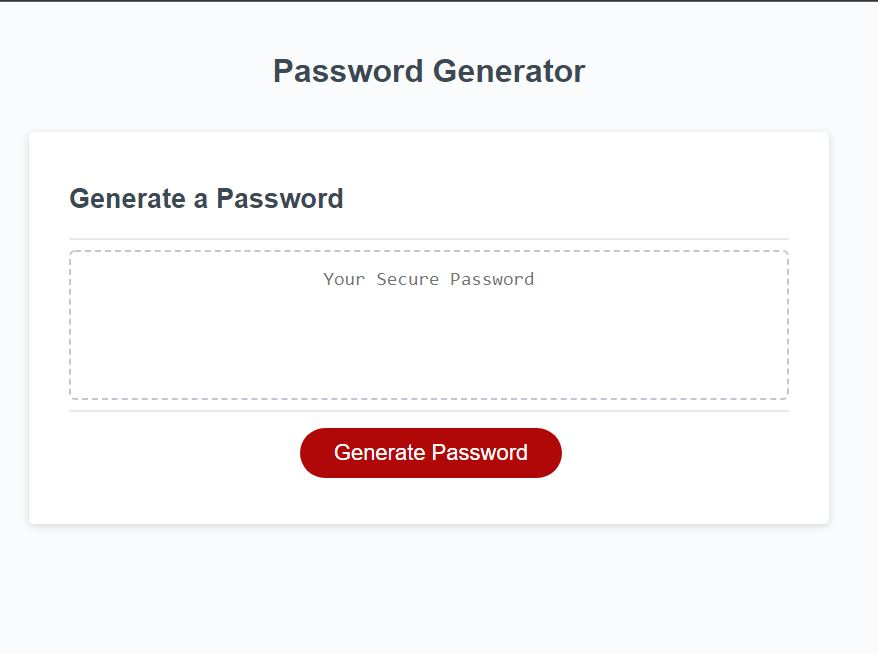

SAFE PASSWORD GENERATOR 

This app is able to randomly generate a password from 8 to 128 characters long.

Additionally, it asks the user to decide whether lowercaseletters, capital letters, numbers and special characters should be included.

To start, just click on the red button that says "generate" and answer the prompts.

Here's the github link to the deployed app: https://javierrmsf.github.io/Safe-Password-Generator/

Here's the github link to the repo: https://github.com/Javierrmsf/Safe-Password-Generator